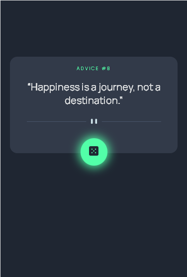

# Frontend Mentor - Advice generator app solution

This is a solution to the [Advice generator app challenge on Frontend Mentor](https://www.frontendmentor.io/challenges/advice-generator-app-QdUG-13db). Frontend Mentor challenges help you improve your coding skills by building realistic projects.

## Table of contents

- [Overview](#overview)
  - [The challenge](#the-challenge)
  - [Screenshot](#screenshot)
  - [Links](#links)
- [My process](#my-process)
  - [Built with](#built-with)
  - [What I learned](#what-i-learned)
  - [Continued development](#continued-development)
  - [Useful resources](#useful-resources)
- [Author](#author)
- [Acknowledgments](#acknowledgments)

## Overview

### The challenge

Users should be able to:

- View the optimal layout for the app depending on their device's screen size
- See hover states for all interactive elements on the page
- Generate a new piece of advice by clicking the dice icon

### Screenshot



### Links

- Solution URL: https://github.com/Pratiksha1699/Advice-Generator-App
- Live Site URL: https://advice-generator-app-git-main-pratiksha1699.vercel.app/

## My process

### Built with

- HTML 
- CSS custom properties
- [React](https://reactjs.org/) - JS library

### What I learned

While working through the project, used react hooks : useState and useEffect to display the initial state when webpage is loaded:

```js
useEffect(() => {
		fetchAdvice();
	}, [url]);
```

### Continued development

Would like to learn more about font smoothing, for this project the default font is used. In future, would like to include advices based on the categories
### Useful resources

- [Example resource 1](https://reactjs.org/docs/hooks-intro.html) - This helped me for adding hooks in this project. It is a part of reactjs documentation about hooks.

## Author

- Frontend Mentor - [@Pratiksha1699](https://www.frontendmentor.io/profile/Pratiksha1699)

## Acknowledgments
I have learned from this project a lot. I would recommend taking frontend mentor challenges for practising and even it helps for learning new things and imporving coding skills. Grateful to them that they provide such great platform for developers. 
